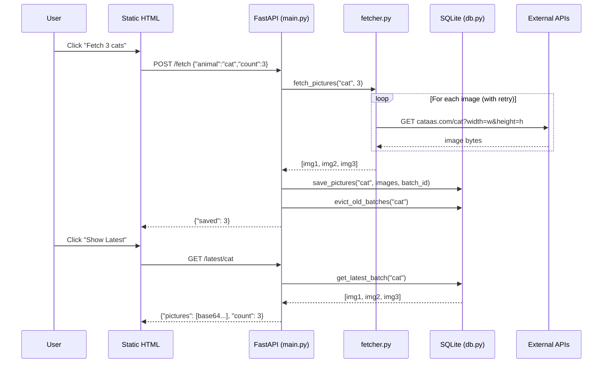

# Design

## Application Architecture

The app follows a simplified 3-tier pattern, collapsed into a single process:

```
┌──────────────────────────────────────────────────┐
│  Presentation Layer          (static/index.html) │
│  Single HTML page + vanilla JS                   │
├──────────────────────────────────────────────────┤
│  Application Layer                    (main.py)  │
│  FastAPI routes, validation, orchestration       │
├──────────────┬───────────────────────────────────┤
│  Data Layer  │  Integration Layer                │
│  (db.py)     │  (fetcher.py)                     │
│  SQLite R/W  │  HTTP to external APIs            │
└──────────────┴───────────────────────────────────┘
```

- **Presentation**: Static HTML served by FastAPI's static file mount. No framework, no build step.
- **Application**: Receives requests, validates input (Pydantic), orchestrates data flow between fetcher and DB.
- **Data**: SQLite via stdlib `sqlite3`. Schema init, CRUD, retention/eviction logic.
- **Integration**: Async HTTP client (httpx) that talks to external animal picture APIs.

All four components live in one process, one container, one deployable unit. No inter-service communication.

## Request Flow



## Module Responsibilities

| Module | Role | Depends on |
|--------|------|-----------|
| `main.py` | Routes + orchestration | db.py, fetcher.py |
| `db.py` | Storage + retention | sqlite3 (stdlib) |
| `fetcher.py` | External API calls | httpx |
| `static/index.html` | UI | Browser + API endpoints |

## Database Schema

```sql
CREATE TABLE pictures (
    id INTEGER PRIMARY KEY AUTOINCREMENT,
    animal TEXT NOT NULL,
    image BLOB NOT NULL,
    batch_id TEXT NOT NULL,
    created_at TEXT NOT NULL DEFAULT (datetime('now'))
);
CREATE INDEX idx_animal_batch ON pictures(animal, batch_id);
CREATE INDEX idx_animal_created ON pictures(animal, created_at DESC);
```

`batch_id` (UUID per fetch call) enables eviction by "call" rather than by row count.

## Endpoint Contracts

| Method | Path | Request | Success | Error |
|--------|------|---------|---------|-------|
| POST | `/fetch` | `{"animal": "cat", "count": 3}` | `200 {"saved": 3}` | 422 (validation), 502 (all failed) |
| GET | `/latest/{animal}` | — | `200 {"pictures": [...], "count": N}` | 404, 422 |
| GET | `/pictures/{animal}` | — | `200 {"pictures": [...], "count": N}` | 404, 422 |

## Key Decisions

| Decision | Rationale |
|----------|-----------|
| BLOBs in SQLite | No volume mounts, portable single-file DB. ~4MB max at full capacity. |
| batch_id per fetch call | Enables "evict oldest call" logic cleanly. |
| httpx (async) | Pairs with FastAPI's async handlers. |
| Retry 2× per image | Balances resilience vs latency. |
| Dimension jitter (395–405 × 295–305) | PlaceBear returns static images per fixed dimension — jitter gives variety. |
| cataas.com for cats | placekitten.com is down (521). cataas.com supports width/height params and returns genuinely random images (jitter still applied for consistency across all three APIs). |
| base64 JSON for multi-image responses | Simple gallery rendering without multiple round-trips. |
| Eviction on write | No background jobs — keeps architecture single-process. |
| Static HTML, no JS framework | One file, no build step. Meets "simple UI" bonus. |

## Data Flow

```
POST /fetch {animal, count}
  → fetcher.fetch_pictures(animal, count)     # HTTP with retry + jitter
  → db.save_pictures(animal, images, batch_id) # bulk insert
  → db.evict_old_batches(animal)               # keep last 5 calls
  → {"saved": N}

GET /latest/{animal}
  → db.get_latest_batch(animal)   # all images from most recent batch_id
  → {"pictures": [base64...], "count": N}

GET /pictures/{animal}
  → db.get_all_pictures(animal)   # all retained images, newest-first
  → {"pictures": [base64...], "count": N}
```
